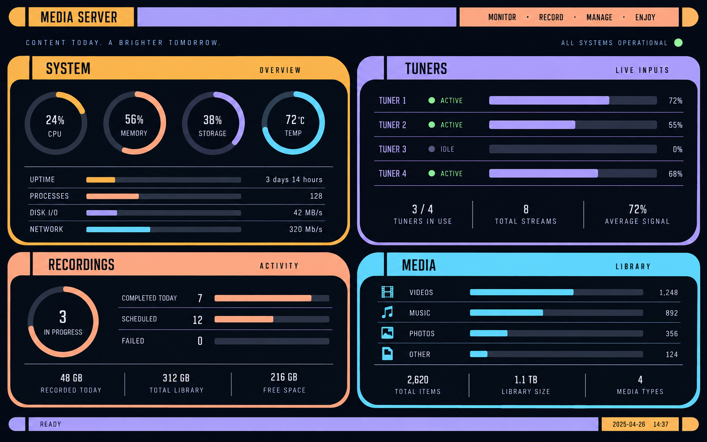

# STAR TREK LCARS SERVER MONITOR

[中文](#中文) · [日本語](#日本語) · [English](#english)



> Illustration only. The image contains fictional, non-sensitive values rather than a capture from a real server.

A lightweight, local-only server monitor with a Star Trek LCARS-inspired interface. It is intended for a small HDMI display attached to a media/TV server and deliberately remains read-only.

## 中文

### 项目简介

**STAR TREK LCARS SERVER MONITOR** 是为 Ubuntu 媒体/电视服务器设计的本地状态显示系统。它在小尺寸 HDMI 显示器上以无浏览器边框的全屏 kiosk 方式长期运行，快速展示服务状态，而不充当服务器管理后台。

界面按固定顺序自动轮播：

```text
SYSTEM → MIRAKURUN → EPGSTATION → JELLYFIN → SYSTEM
```

默认每页显示 30 秒、完整循环 120 秒。可在 `frontend/config.js` 通过 `PAGE_ROTATION_SECONDS` 调整停留时间。

### 功能

- **SYSTEM**：主机名、LAN IP、内核、运行时间、CPU/各核心负载、温度、内存、根目录和录制盘空间、网络实时流量，以及 Jellyfin 当前播放摘要。
- **MIRAKURUN**：版本、流资源统计、动态 tuner 列表、GR/BS/CS 类型、真实占用状态与当前频道。支持 Mirakurun 4.x 的 `isUsing`/`users` 字段，可正确显示直播和 EPG 抓取造成的占用。
- **EPGSTATION**：当前录制、下一条预约、录制盘使用率与可用容量。
- **JELLYFIN**：活动播放会话、用户/设备/客户端、媒体或频道名称、可用时的播放进度及节目图片。
- **自动全屏启动**：systemd 在开机后启动本地后端及 Xorg/Openbox/Luakit kiosk，不显示地址栏、标签栏或窗口边框。
- **安全降级**：上游服务无法访问时仅显示 `UNAVAILABLE`，不会修改、重启或控制任何电视服务。

### 架构与安全边界

```text
HDMI display
  └─ Xorg / Openbox / Luakit fullscreen kiosk
       └─ LCARS single-page interface
            └─ localhost:8765 Python read-only API
                 ├─ Linux /proc, /sys and filesystem metrics
                 ├─ Mirakurun API (localhost:40772)
                 ├─ EPGStation API (localhost:8888)
                 └─ Jellyfin API (localhost:8096)
```

这是一个**只读显示系统**：后端只监听 `127.0.0.1:8765`；不连接 Docker Socket、不管理容器、不读取或控制 Threadfin；不创建/取消 EPGStation 预约，也不控制 Mirakurun、Jellyfin、录制或播放。后端使用无登录权限的 `lcars` 用户和 systemd 沙箱。Jellyfin API Key 由仓库外的 root-only 文件以 systemd credential 方式提供，绝不进入 Git、前端或日志。

### 环境要求、配置与操作

需要 Ubuntu Server（或兼容的 systemd Linux）、HDMI 输出、Python 3、Xorg、Openbox、Luakit、`xdotool`、`unclutter`。可选的 Mirakurun、EPGStation、Jellyfin 默认运行在本机端口 40772、8888、8096；Mirakurun 4.x 已支持，其他版本请先检查 `/api/tuners` 的返回结构。

应用目录为 `/opt/lcars-monitor`。请参考 `config/lcars-monitor.example.env`，在仓库**外部**创建 `/etc/lcars-monitor/jellyfin.env`，权限设为 `0600`：

```text
JELLYFIN_API_KEY=replace-with-a-restricted-jellyfin-api-key
```

```bash
sudo systemctl status lcars-backend lcars-kiosk
sudo systemctl restart lcars-backend
sudo systemctl restart lcars-kiosk
journalctl -u lcars-backend -u lcars-kiosk -f
curl http://127.0.0.1:8765/api/status
```

kiosk 会话会禁用 screensaver 与 DPMS，但不会控制显示器的物理背光开关。物理关屏期间后端仍继续运行；重新开屏后若没有恢复图像，只需执行 `sudo systemctl restart lcars-kiosk`。部署或卸载时，请勿删除 Docker、Threadfin、Mirakurun、EPGStation、Jellyfin、录制盘或媒体数据。

## 日本語

### 概要

**STAR TREK LCARS SERVER MONITOR** は、Ubuntu のテレビ・メディアサーバーに接続した小型 HDMI ディスプレイ向けのローカル専用ステータスモニターです。LCARS をイメージした画面を、ブラウザーの UI を表示しない全画面 kiosk として常時表示します。

`SYSTEM`、`MIRAKURUN`、`EPGSTATION`、`JELLYFIN` の 4 ページを固定順で循環します。標準設定は 1 ページ 30 秒、1 周 120 秒で、`frontend/config.js` の `PAGE_ROTATION_SECONDS` から変更できます。

### 機能

- **SYSTEM**：ホスト情報、LAN IP、カーネル、稼働時間、CPU、温度、メモリー、ストレージ、ネットワーク速度、Jellyfin 再生概要。
- **MIRAKURUN**：バージョン、ストリーム資源、GR/BS/CS チューナー、利用状態、受信チャンネル。Mirakurun 4.x の `isUsing` と `users` を解釈し、ライブ視聴と EPG 取得の実際の占有を表示します。
- **EPGSTATION**：録画中、次の予約、録画用ストレージ。
- **JELLYFIN**：再生中セッション、ユーザー/デバイス/クライアント、番組名、再生進捗、利用可能な画像。
- **自動起動**：systemd がローカル API と Xorg/Openbox/Luakit の全画面 kiosk を起動します。
- **安全な障害表示**：サービス障害時は `UNAVAILABLE` と表示するだけで、既存サービスを操作しません。

### セキュリティと運用

このソフトウェアは**監視表示専用**です。API は `127.0.0.1:8765` のみで待ち受け、Docker Socket、Threadfin、録画予約、Mirakurun のチューナー制御、Jellyfin の再生制御にはアクセスしません。Jellyfin API Key は Git 管理外の root 専用ファイルから systemd credential として読み込まれ、リポジトリー、ブラウザー、ログには含まれません。

systemd を備えた Ubuntu Server、HDMI 出力、Python 3、Xorg、Openbox、Luakit、`xdotool`、`unclutter` を想定します。`config/lcars-monitor.example.env` を参照し、Key は `/etc/lcars-monitor/jellyfin.env` に `0600` で保存してください。

```bash
sudo systemctl status lcars-backend lcars-kiosk
sudo systemctl restart lcars-backend
sudo systemctl restart lcars-kiosk
journalctl -u lcars-backend -u lcars-kiosk -f
```

物理的なバックライトの ON/OFF は本ソフトウェアでは制御しません。導入・削除時には既存の GUI、録画、配信サービスやメディアデータを置き換えたり削除したりしないでください。

## English

### Overview

**STAR TREK LCARS SERVER MONITOR** is a lightweight, local-only status display for an Ubuntu media or TV server. It runs as a long-lived fullscreen kiosk on a small HDMI display and provides a Star Trek LCARS-inspired, read-only view of the server.

It rotates through four fixed pages:

```text
SYSTEM → MIRAKURUN → EPGSTATION → JELLYFIN → SYSTEM
```

The default dwell time is 30 seconds per page, or 120 seconds for one full cycle. Set `PAGE_ROTATION_SECONDS` in `frontend/config.js` to change it.

### Features

- **SYSTEM** — hostname, LAN address, kernel, uptime, CPU/core load, temperature, memory, root and recording storage, live network rate, and a Jellyfin playback summary.
- **MIRAKURUN** — version, stream resource counts, dynamically discovered GR/BS/CS tuners, true activity state, and tuned channel. Mirakurun 4.x `isUsing` and `users` fields are interpreted so live viewing and EPG gathering are shown accurately.
- **EPGSTATION** — active recording, next reservation, and recording-storage capacity.
- **JELLYFIN** — active sessions, user/device/client, media or channel name, playback progress when available, and primary artwork.
- **Fullscreen autostart** — systemd starts the local backend and an Xorg/Openbox/Luakit kiosk with no browser chrome.
- **Non-invasive failures** — unreachable services are shown as `UNAVAILABLE`; the monitor does not restart, modify, or control them.

### Architecture, privacy, and requirements

The display is an HDMI → Xorg/Openbox/Luakit kiosk → single-page interface → local Python API stack. The Python API consumes Linux statistics plus local Mirakurun (40772), EPGStation (8888), and Jellyfin (8096) APIs.

It binds only to `127.0.0.1:8765`; does not use the Docker socket; does not manage containers, Threadfin, reservations, tuners, recordings, or playback; and uses an unprivileged `lcars` account with systemd sandboxing. A restricted Jellyfin API key is loaded as a systemd credential from a root-only file outside this repository.

Use Ubuntu Server or compatible systemd Linux with HDMI output, Python 3, Xorg, Openbox, Luakit, `xdotool`, and `unclutter`. Mirakurun 4.x is supported; verify `/api/tuners` before using a different schema.

Keep secrets out of Git. Use `config/lcars-monitor.example.env` as a template and create `/etc/lcars-monitor/jellyfin.env` with mode `0600`.

```bash
sudo systemctl status lcars-backend lcars-kiosk
sudo systemctl restart lcars-backend
sudo systemctl restart lcars-kiosk
journalctl -u lcars-backend -u lcars-kiosk -f
curl http://127.0.0.1:8765/api/status
```

The kiosk disables screensaver and DPMS, but never overrides a display's physical backlight switch. Review existing graphical sessions and production services before deployment. Never remove Docker, Threadfin, Mirakurun, EPGStation, Jellyfin, recording storage, or media data while uninstalling this project.

## Repository layout

```text
assets/        Sanitized README illustration
backend/       Local Python read-only API
frontend/      LCARS single-page interface
scripts/       Backend and kiosk launch scripts
systemd/       Service unit templates
config/        Secret-free configuration example
```

## License

No license has been selected yet. Add one before redistributing or accepting external contributions.
